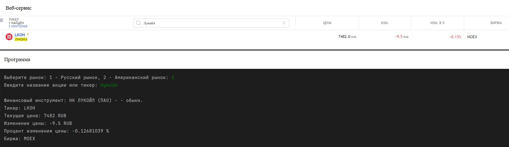
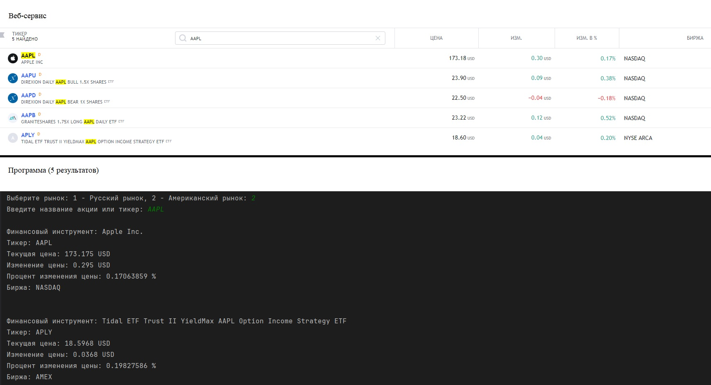

# Получение данных акций с веб-сервиса TV

Получение данных российских и американских акций в реальном времени.
Была использована библиотека `requests`.

Для этой цели был разработан механизм, который осуществляет HTTP-запросы к соответствующим источникам данных, 
чтобы получить актуальные котировки акций.

**Пример полученных данных с российской биржи:**

**Пример полученных данных с американской биржи:**

